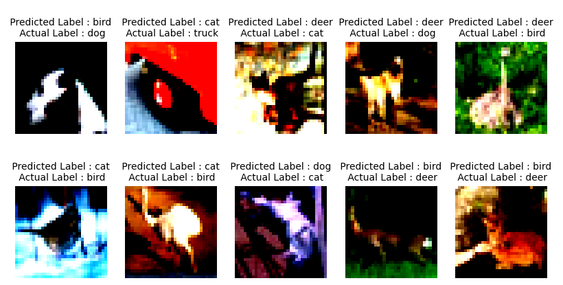
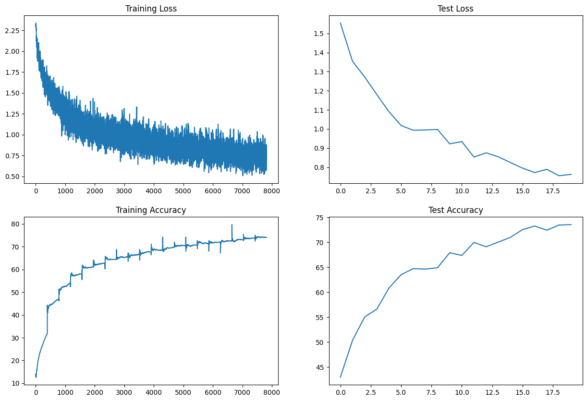
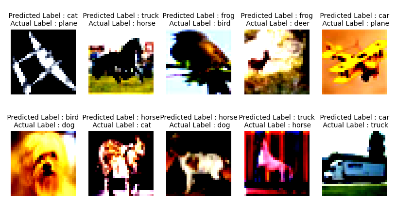
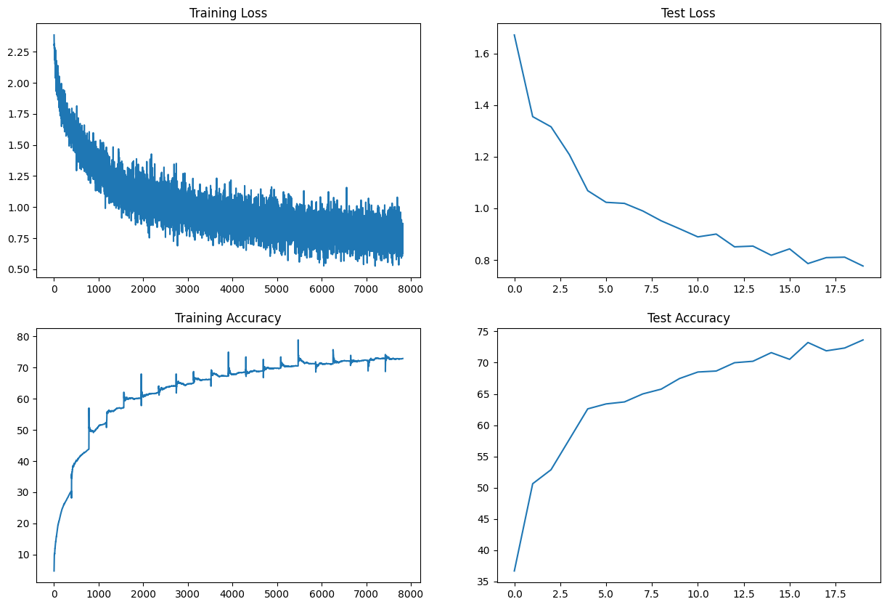
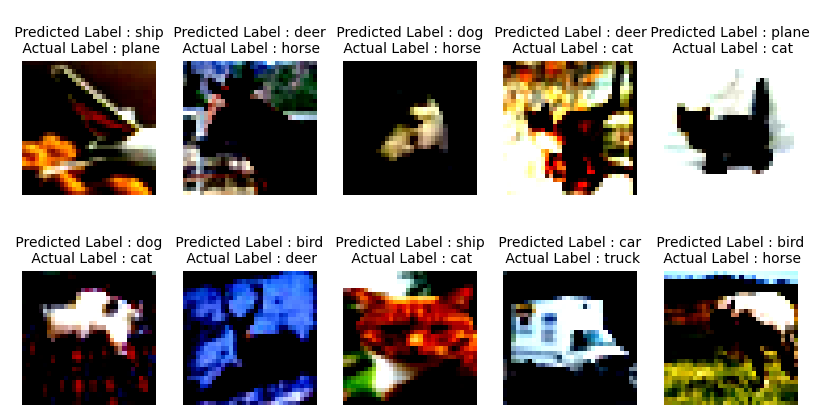

# ERA S8 Assignment

This repository contains the code for the S8 assignment of the ERA course.

The task is to try how different normalization techniques affect the performance of a CNN model. The model is trained on the CIFAR10 dataset by the following guidelines:

Make this network:

    - C1 C2 c3 P1 C4 C5 c6 P2 C7 C8 C9 GAP C10
    - Keep the parameter count less than 50000
    - Try and add one layer to another
    - Max Epochs is 20

    Here C is Convolution, P is Pooling and c is Max pooling


## Pre-requisites

The code is written in Python 3.10.11. It is recommended to use a virtual environment to run the code to avoid dependency issues. Try to use Google Colab or Kaggle to run the code as they provide free access to GPUs. If you are running the code on your local machine, make sure you install the virtual environment before running the code.

### Installing the Virtual Environment

It is advised to install Anaconda to manage the virtual environment. Anaconda can be downloaded from [here](https://www.anaconda.com/products/individual). Once installed, the virtual environment can be created using the following command:

```bash
conda create -n era python=3.10.11
```

### Activating the Virtual Environment

The virtual environment needs to be activated before running the code. This can be done using the following command:

```bash
conda activate era
```

## Installation

1. Clone the repository using the following command:

    ```bash
    git clone https://github.com/ChikkaUdayaSai/ERA-S8-Assignment
    ```

2. Navigate to the repository directory:

    ```bash
    cd ERA-S8-Assignment
    ```

3. Install the dependencies using the following commnad:

    ```bash
    pip install -r requirements.txt
    ```

Note: If you are using Google Colab or Kaggle, you can skip the above step as the dependencies are already installed in the environment. But it is advised to check the versions of the dependencies before running the code.

The code uses PyTorch and Torchvision for fetching the MNIST dataset and training the model. An additional dependency, Matplotlib, is used for plotting the training and validation losses. Finally, the Torchsummary package is used to visualize the model architecture.

We are now ready to run the code with the following versions of the dependencies:

- **PyTorch: 2.0.1**
- **Torchvision: 0.15.2**
- **Matplotlib: 3.7.1**
- **Torchsummary: 1.5.1**


## Solution

There are 3 notebooks in the repository one for each normalization technique. The notebooks are named as follows:

1. Session8_BatchNorm.ipynb
2. Session8_GroupNorm.ipynb
3. Session8_LayerNorm.ipynb

The notebooks are self explanatory and contain the code for the respective normalization techniques. 
The entire code is divided into different modules for better readability and understanding. The modules are as follows:

    1. dataset.py - Contains the code for fetching the CIFAR10 dataset and creating the train and test data loaders.
    2. model.py - Contains the code for the model architecture.
    3. utils.py - Contains the code for training and testing the model.

The code is well documented and the comments are provided wherever necessary. The code is also well structured and the functions are defined in a modular way. The code is also written in a way that it can be easily extended to other normalization techniques.

## Results

### Batch Normalization

For the batch normalization technique, the model was trained for 20 epochs. The training and validation losses are plotted below:


The model achieved a training accuracy of **75.46%** and a validation accuracy of **77.38**.

The misclassified images are plotted below:



### Group Normalization

For the group normalization technique, the model was trained for 20 epochs. The training and validation losses are plotted below:



The model achieved a training accuracy of **74.03%** and a validation accuracy of **73.56%**.

The misclassified images are plotted below:



### Layer Normalization

For the layer normalization technique, the model was trained for 20 epochs. The training and validation losses are plotted below:



The model achieved a training accuracy of **72.94%** and a validation accuracy of **73.63%**.

The misclassified images are plotted below:



## Inference

The batch normalization technique performed better than the other two normalization techniques. The model achieved a validation accuracy of **77.38%** which is higher compared to other models. It provides a good trade-off between the training and validation accuracies. The model can be further improved by increasing the number of epochs and by using a learning rate scheduler. However, it is not good idea to judge based on single dataset and single run. The model can be further improved by using different hyperparameters and by using different normalization techniques. However, the results confirm that Batch Normalization is good for CNNs.